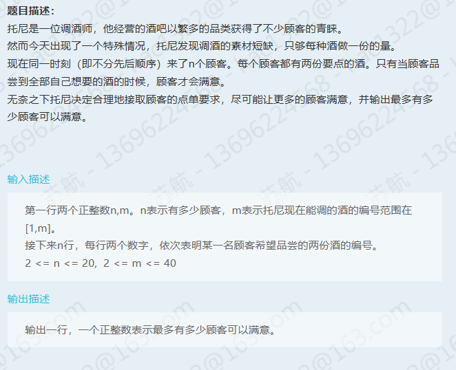

# 第一题



```bash
// 输入
3 4
1 2
2 3
3 4

// 输出
2
```

```java
import java.util.Arrays;
import java.util.Scanner;


public class Main {
    public static void main(String[] args) {
        Scanner scanner = new Scanner(System.in);

        int n = scanner.nextInt();
        int m = scanner.nextInt();

        int[][] requests = new int[n][2];
        for (int i = 0; i < n; i++) {
            requests[i][0] = scanner.nextInt();
            requests[i][1] = scanner.nextInt();
        }
        int[] stock = new int[m + 1];
        Arrays.fill(stock, 1);
        int maxSatisfied = 0;
        for (int i = 0; i < n; i++) {
            boolean flag = true;
            for (int j = 0; j < 2; j++) {
                if (stock[requests[i][j]] <= 0) {
                    flag = false;
                    break;
                }
            }
            if (flag) {
                for (int j = 0; j < 2; j++) {
                    stock[requests[i][j]]--;
                }
                maxSatisfied += 1;
            }
        }
        System.out.println(maxSatisfied);
    }
}

```

通过率：55%【排查不出问题】

## 第二题

不会
