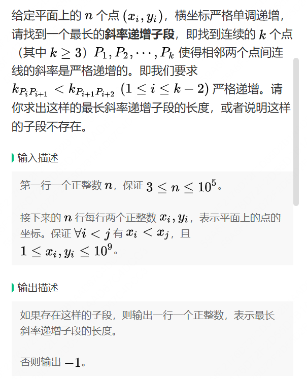
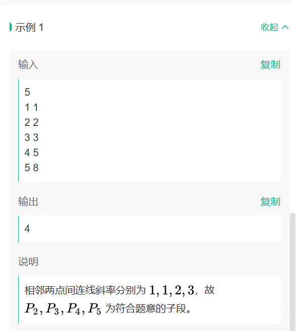
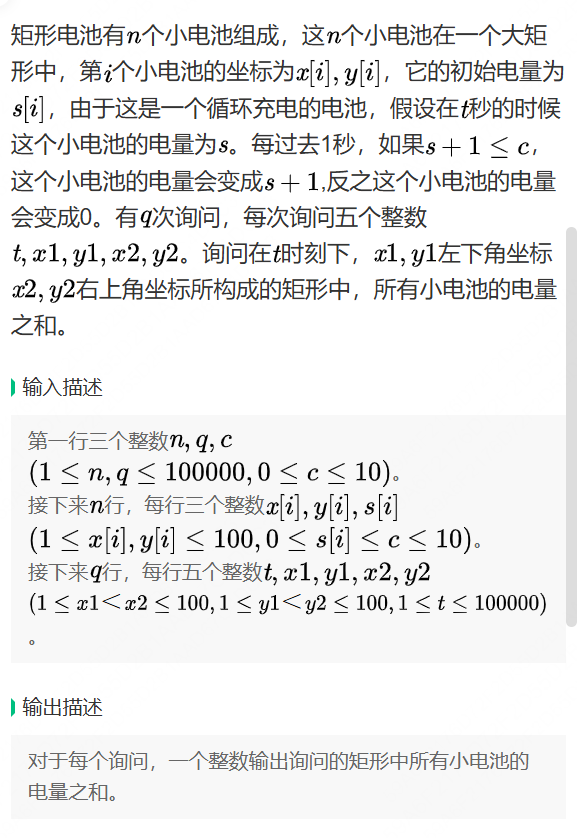
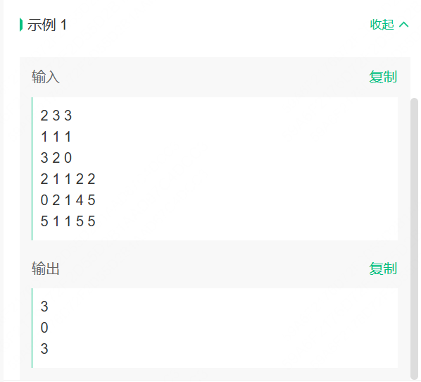

# 第一题




```java
 
import java.util.Scanner;

public class Main {
    public static void main(String[] args) {
        Scanner scanner = new Scanner(System.in);
        int n = scanner.nextInt();
        long[] x = new long[n];
        long[] y = new long[n];

        for (int i = 0; i < n; i++) {
            x[i] = scanner.nextLong();
            y[i] = scanner.nextLong();
        }

        int maxLength = -1;
        int currentLength = 2;

        for (int i = 2; i < n; i++) {
            double slope1 = (double) (y[i] - y[i - 1]) / (x[i] - x[i - 1]);
            double slope2 = (double) (y[i - 1] - y[i - 2]) / (x[i - 1] - x[i - 2]);

            if (slope1 > slope2) {
                currentLength++;
                maxLength = Math.max(maxLength, currentLength);
            } else {
                currentLength = 2;
            }
        }

        System.out.println(maxLength);
    }
}

```

# 第二题



