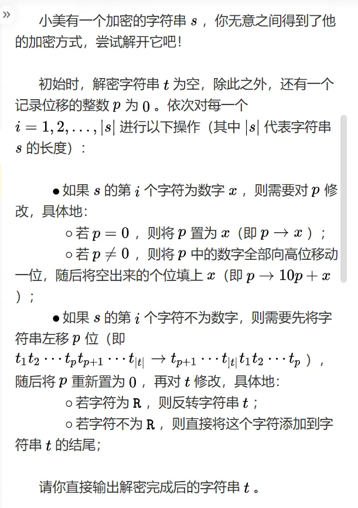
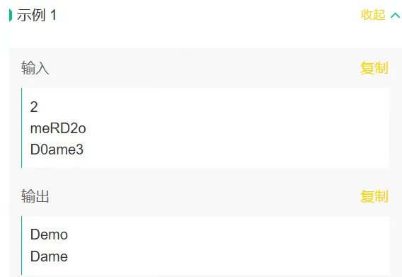
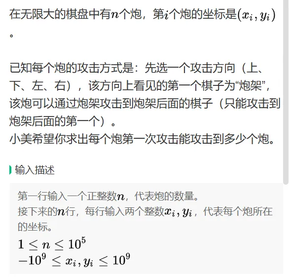

# 第一题的题目
说明：第一题 成功OC。



```java
// 通过v1.0   40min

import java.util.ArrayList;
import java.util.Scanner;


public class Main {
    public static void main(String[] args) {
        Scanner in = new Scanner(System.in);
        int N = in.nextInt();
        ArrayList<String> res = new ArrayList<>();

        while (N >= 0) {
            // 初始
            int p = 0;
            StringBuilder t = new StringBuilder();
            String s = in.nextLine();
            if (s == null || s.isEmpty()) { // 处理回车
                N--;
                continue;
            }
            // 处理每组输入
            for (int i = 0; i < s.length(); i++) {
                // 如果是数字
                if (Character.isDigit(s.charAt(i))) {
                    // p为0
                    if (p == 0) {
                        p = Integer.parseInt(s.charAt(i) + "");
                    } else {
                        // p不为0
                        p = p * 10 + Integer.parseInt(s.charAt(i) + "");
                    }
                } else { // 如果不是数字
                    // p不等于0 左移p位   
                    if (p != 0) {
                        p = t.length() != 0 ? p % t.length() : p;
                        if (t.length() > 0) { // 防止下标越界
                            for (int j = 0; j < p; j++) {
                                t.append(t.charAt(0));
                                t.deleteCharAt(0);
                            }
                        }
                        p = 0;
                    }
                    if (s.charAt(i) == 'R') {
                        t.reverse();
                    } else {
                        t.append(s.charAt(i));
                    }
                }
            }
            res.add(t.toString());
            N -= 1;
        }
        for (String s : res) {
            System.out.println(s);
        }
    }
}
```

## 第二题的题目
说明：没时间了，当时还有点小错误===>遇到第二次节点，也要判断是否为 1。if (arr[i][y] == 1 && flag)。也可以计数的方式。



```txt
输入：
6
0 0
0 1
0 2
1 0
2 0
3 0


输出：
2
0
1
1
1
1
```

```java
public class Main {
    public static void main(String[] args) {
        Scanner in = new Scanner(System.in);
        // N个炮
        int N = in.nextInt();
        ArrayList<Integer> res = new ArrayList<>();

        int[][] arr = new int[10000][10000];
        ArrayList<String> list = new ArrayList<>();
        while (N > 0) {
            // 输入坐标(xi,yi)
            int xi = in.nextInt();
            int yi = in.nextInt();
            if (xi >= arr.length || yi >= arr.length) {
                continue;
            }
            list.add(xi + "," + yi);
            arr[xi][yi] = 1;// 炮的位置
            N -= 1;
        }
        for (int j = 0; j < list.size(); j++) {
            String[] split = list.get(j).split(",");
            int x = Integer.parseInt(split[0]);
            int y = Integer.parseInt(split[1]);
            // 炮可以攻击的数量
            int count = 0;

            // 四个方向

            // x负方向[x不变]
            boolean flag = false;
            for (int i = y - 1; i >= 0; i--) {
                if (arr[x][i] == 1 && flag) {
                    count++;
                    break;
                }
                if (arr[x][i] == 1) {
                    flag = true;
                }
            }

            // x正方向
            flag = false;
            for (int i = y + 1; i < arr[0].length; i++) {
                if (arr[x][i] == 1 && flag) {
                    count++;
                    break;
                }
                if (arr[x][i] == 1) {
                    flag = true;
                }
            }

            // y负方向
            flag = false;
            for (int i = x - 1; i >= 0; i--) {
                if (arr[i][y] == 1 && flag) {
                    count++;
                    break;
                }
                if (arr[i][y] == 1) {
                    flag = true;
                }
            }

            // y正方向
            flag = false;
            for (int i = x + 1; i < arr.length; i++) {
                if (arr[i][y] == 1 && flag) {
                    count++;
                    break;
                }
                if (arr[i][y] == 1) {
                    flag = true;
                }
            }
            res.add(count);
        }
        for (Integer i : res) {
            System.out.println(i);
        }
    }
}
```