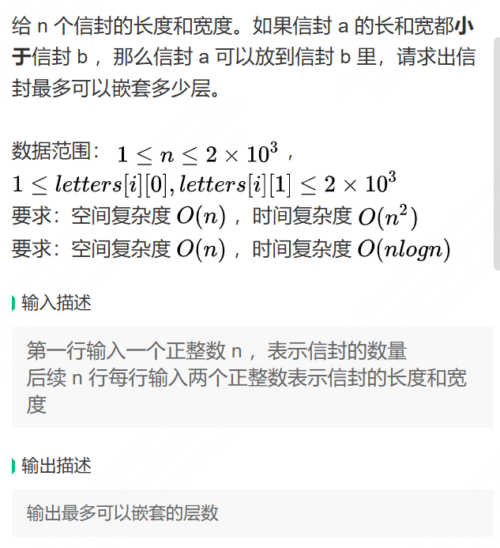

## 第一题


```java
import java.util.*;

/*
 * public class TreeNode {
 *   int val = 0;
 *   TreeNode left = null;
 *   TreeNode right = null;
 *   public TreeNode(int val) {
 *     this.val = val;
 *   }
 * }
 */

public class Solution {
    /**
     * 代码中的类名、方法名、参数名已经指定，请勿修改，直接返回方法规定的值即可
     *
     *
     * @param root TreeNode类
     * @return TreeNode类
     */
    public TreeNode expandTree (TreeNode root) {
        TreeNode current = root;

        while (current != null) {
            // 如果当前节点的左子节点不为空
            if (current.left != null) {
                // 找到当前节点左子树的最右节点
                TreeNode predecessor = current.left;
                while (predecessor.right != null) {
                    predecessor = predecessor.right;
                }

                // 将当前节点的右子树接到左子树的最右节点的右孩子位置
                predecessor.right = current.right;

                // 将当前节点的左子树转换为其右子树
                current.right = current.left;
                current.left = null;
            }

            // 移动到当前节点的右子节点
            current = current.right;
        }

        return root;
    }
}
```

## 第二题

输入：
```bash
9
3 4
2 3
4 5
1 3
2 2
3 6
1 2
3 2
2 4
```

输出：
```bash
4
```

```java
import java.util.Arrays;
import java.util.Scanner;

public class Main {

    public static void main(String[] args) {
        Scanner scanner = new Scanner(System.in);

        // 读取信封数量
        int n = scanner.nextInt();
        int[][] envelopes = new int[n][2];

        // 读取每个信封的长度和宽度
        for (int i = 0; i < n; i++) {
            envelopes[i][0] = scanner.nextInt();
            envelopes[i][1] = scanner.nextInt();
        }

        // 按宽度升序排序，如果宽度相同，则按高度降序排序
        Arrays.sort(envelopes, (a, b) -> a[0] == b[0] ? b[1] - a[1] : a[0] - b[0]);

        // 动态规划找最长递增子序列（基于高度）
        int[] dp = new int[n];
        int max = 0;

        for (int i = 0; i < n; i++) {
            dp[i] = 1; // 每个信封至少可以单独作为一层
            for (int j = 0; j < i; j++) {
                if (envelopes[i][1] > envelopes[j][1]) {
                    dp[i] = Math.max(dp[i], dp[j] + 1);
                }
            }
            max = Math.max(max, dp[i]);
        }

        // 输出结果
        System.out.println(max);

        scanner.close();
    }
}

```